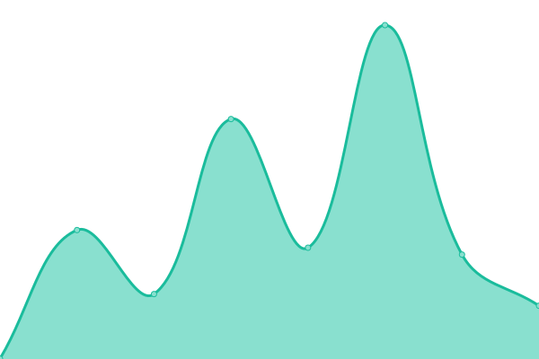

# [📈 Live Status](https://bitnob.github.io/uptime): <!--live status--> **🟩 All systems operational**

This repository contains the open-source uptime monitor and status page for [Bitnob](https://bitnob.com), powered by [Upptime](https://github.com/upptime/upptime).

With [Upptime](https://upptime.js.org), you can get your own unlimited and free uptime monitor and status page, powered entirely by a GitHub repository. We use [Issues](https://github.com/bitnob/uptime/issues) as incident reports, [Actions](https://github.com/bitnob/uptime/actions) as uptime monitors, and [Pages](https://bitnob.github.io/uptime) for the status page.

<!--start: status pages-->
<!-- This summary is generated by Upptime (https://github.com/upptime/upptime) -->
<!-- Do not edit this manually, your changes will be overwritten -->
<!-- prettier-ignore -->
| URL | Status | History | Response Time | Uptime |
| --- | ------ | ------- | ------------- | ------ |
|  [Website](https://bitnob.com) | 🟩 Up | [website.yml](https://github.com/bitnob/uptime/commits/HEAD/history/website.yml) | 

 745ms
     
 | 

<a href="https://status.bitnob.com/history/website">100.00%</a>
    

|  [Business API](https://api.bitnob.co/health) | 🟩 Up | [business-api.yml](https://github.com/bitnob/uptime/commits/HEAD/history/business-api.yml) | 

 513ms
     
 | 

<a href="https://status.bitnob.com/history/business-api">100.00%</a>
    

|  [API Documentation](https://docs.bitnob.com/docs) | 🟩 Up | [api-documentation.yml](https://github.com/bitnob/uptime/commits/HEAD/history/api-documentation.yml) | 

 470ms
     
 | 

<a href="https://status.bitnob.com/history/api-documentation">100.00%</a>
    

|  [Dashboard](https://app.bitnob.co) | 🟩 Up | [dashboard.yml](https://github.com/bitnob/uptime/commits/HEAD/history/dashboard.yml) | 

 1075ms
     
 | 

<a href="https://status.bitnob.com/history/dashboard">100.00%</a>
    

|  [Hosted Checkout](https://checkout.bitnob.co) | 🟩 Up | [hosted-checkout.yml](https://github.com/bitnob/uptime/commits/HEAD/history/hosted-checkout.yml) | 

 774ms
     
 | 

<a href="https://status.bitnob.com/history/hosted-checkout">100.00%</a>
    

|  [Sandbox API](https://sandboxapi.bitnob.co/health) | 🟩 Up | [sandbox-api.yml](https://github.com/bitnob/uptime/commits/HEAD/history/sandbox-api.yml) | 

 499ms
     
 | 

<a href="https://status.bitnob.com/history/sandbox-api">100.00%</a>
    

|  [Sandbox Dashboard](https://sandboxapp.bitnob.co) | 🟩 Up | [sandbox-dashboard.yml](https://github.com/bitnob/uptime/commits/HEAD/history/sandbox-dashboard.yml) | 

 366ms
     
 | 

<a href="https://status.bitnob.com/history/sandbox-dashboard">100.00%</a>
    

|  [Sandbox Hosted Checkout](https://sandbox-checkout.bitnob.co) | 🟩 Up | [sandbox-hosted-checkout.yml](https://github.com/bitnob/uptime/commits/HEAD/history/sandbox-hosted-checkout.yml) | 

 307ms
     
 | 

<a href="https://status.bitnob.com/history/sandbox-hosted-checkout">100.00%</a>
    

<!--end: status pages-->

[**Visit our status website →**](https://bitnob.github.io/uptime)

## 📄 License

- Powered by: [Upptime](https://github.com/upptime/upptime)
- Code: [MIT](./LICENSE) © [Bitnob](https://bitnob.com)
- Data in the `./history` directory: [Open Database License](https://opendatacommons.org/licenses/odbl/1-0/)
