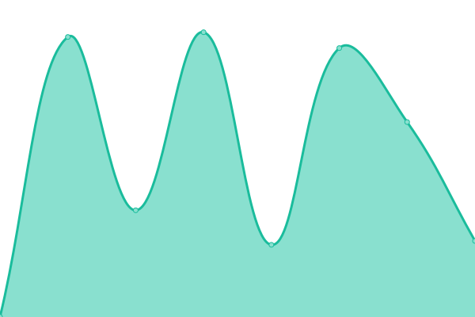

# [📈 Live Status](https://bitnob.github.io/uptime): <!--live status--> **🟩 All systems operational**

This repository contains the open-source uptime monitor and status page for [Bitnob](https://bitnob.com), powered by [Upptime](https://github.com/upptime/upptime).

With [Upptime](https://upptime.js.org), you can get your own unlimited and free uptime monitor and status page, powered entirely by a GitHub repository. We use [Issues](https://github.com/bitnob/uptime/issues) as incident reports, [Actions](https://github.com/bitnob/uptime/actions) as uptime monitors, and [Pages](https://bitnob.github.io/uptime) for the status page.

<!--start: status pages-->
<!-- This summary is generated by Upptime (https://github.com/upptime/upptime) -->
<!-- Do not edit this manually, your changes will be overwritten -->
<!-- prettier-ignore -->
| URL | Status | History | Response Time | Uptime |
| --- | ------ | ------- | ------------- | ------ |
|  [Bitnob Website](https://bitnob.com) | 🟩 Up | [bitnob-website.yml](https://github.com/bitnob/uptime/commits/HEAD/history/bitnob-website.yml) | 

 991ms
     
 | 

<a href="https://status.bitnob.com/history/bitnob-website">100.00%</a>
    

|  [Bitnob API](https://api.bitnob.co/health) | 🟩 Up | [bitnob-api.yml](https://github.com/bitnob/uptime/commits/HEAD/history/bitnob-api.yml) | 

 530ms
     
 | 

<a href="https://status.bitnob.com/history/bitnob-api">100.00%</a>
    

|  [Bitnob API docs](https://docs.bitnob.com/docs) | 🟩 Up | [bitnob-api-docs.yml](https://github.com/bitnob/uptime/commits/HEAD/history/bitnob-api-docs.yml) | 

 696ms
     
 | 

<a href="https://status.bitnob.com/history/bitnob-api-docs">100.00%</a>
    

|  [Bitnob Dashboards](https://app.bitnob.co) | 🟩 Up | [bitnob-dashboards.yml](https://github.com/bitnob/uptime/commits/HEAD/history/bitnob-dashboards.yml) | 

 971ms
     
 | 

<a href="https://status.bitnob.com/history/bitnob-dashboards">100.00%</a>
    

|  [Hosted Checkout](https://checkout.bitnob.co) | 🟩 Up | [hosted-checkout.yml](https://github.com/bitnob/uptime/commits/HEAD/history/hosted-checkout.yml) | 

 386ms
     
 | 

<a href="https://status.bitnob.com/history/hosted-checkout">100.00%</a>
    

|  [Sandbox API](https://sandboxapi.bitnob.co/health) | 🟩 Up | [sandbox-api.yml](https://github.com/bitnob/uptime/commits/HEAD/history/sandbox-api.yml) | 

 538ms
     
 | 

<a href="https://status.bitnob.com/history/sandbox-api">100.00%</a>
    

|  [Sandbox Dashboards](https://sandboxapp.bitnob.co) | 🟩 Up | [sandbox-dashboards.yml](https://github.com/bitnob/uptime/commits/HEAD/history/sandbox-dashboards.yml) | 

 352ms
     
 | 

<a href="https://status.bitnob.com/history/sandbox-dashboards">100.00%</a>
    

|  [Sandbox Hosted Checkout](https://sandbox-checkout.bitnob.co) | 🟩 Up | [sandbox-hosted-checkout.yml](https://github.com/bitnob/uptime/commits/HEAD/history/sandbox-hosted-checkout.yml) | 

 325ms
     
 | 

<a href="https://status.bitnob.com/history/sandbox-hosted-checkout">100.00%</a>
    

|  [Mobile App](https://api.bitnob.app) | 🟩 Up | [mobile-app.yml](https://github.com/bitnob/uptime/commits/HEAD/history/mobile-app.yml) | 

 554ms
     
 | 

<a href="https://status.bitnob.com/history/mobile-app">100.00%</a>
    

<!--end: status pages-->

[**Visit our status website →**](https://bitnob.github.io/uptime)

## 📄 License

- Powered by: [Upptime](https://github.com/upptime/upptime)
- Code: [MIT](./LICENSE) © [Bitnob](https://bitnob.com)
- Data in the `./history` directory: [Open Database License](https://opendatacommons.org/licenses/odbl/1-0/)
